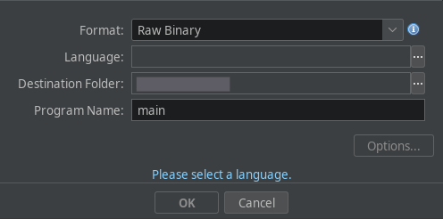
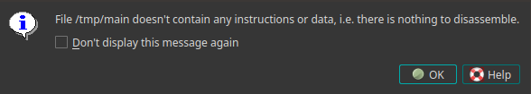
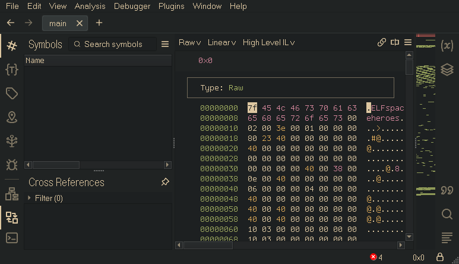
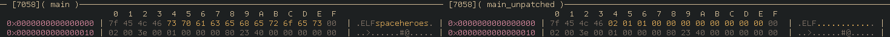
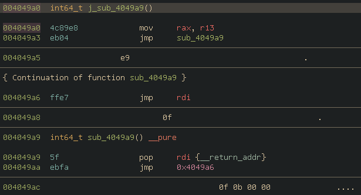

# Environmental Hazard (RE) — Writeup

There are a bunch of technical details that I could dump here, but I think it'll be best to approach this step-by-step for now. A single binary is provided, which `file` identifies as `ELF, unknown class 115`. When the binary is executed, the ASCII art [(thank you Bob Allison, wherever you are…)](http://mewbies.com/geek_fun_files/scarecrow_ascii_art_archive/19940418_Best%20Of%20The%20Scarecrow%27s%20ASCII%20Art%20Archives%20Version%201.0.htm) gets printed out, and then it exits with code 1. 

The next logical step is to rip this open in... maybe GDB?
```
"./main": not in executable format: file format not recognized
```

Alright, so not GDB. Does anything else work?
```lldb
$ lldb main
(lldb) target create "main"
error: './main' doesn't contain any 'host' platform architectures: x86_64, i386
(lldb) exit

$ rz-bin -Iq main
/usr/share/rizin/magic/archive, 139: Warning: New continuation level 2 is more than one larger than current level 0
arch (null)
cpu N/A
bits 64
os (null)
endian little
minopsz 1
maxopsz 16
pcalign 0

$ objdump -d main
objdump: main: file format not recognized
```





Not exactly. Though, the hex editor that Binary Ninja drops us into provides a useful clue: immediately following the ELF file signature (`7F 45 4C 46`), is the string `spaceheroes\0`. Since this is identified as a raw file, Binary Ninja won't import any of the usual ELF data types, but after manually importing a header that does contain them, the first byte in the file can be changed to the type `Elf64_Header` to lay the struct over the raw data so that we can see what's going on here.
```cpp
00000000  struct Elf64_Header data_0 = 
00000000  {
00000000      struct Elf64_Ident ident = 
00000000      {
00000000          char signature[0x4] = "\x7fELF"
00000004          uint8_t file_class = 's'
00000005          uint8_t encoding = 'p'
00000006          uint8_t version = 'a'
00000007          uint8_t os = 'c'
00000008          uint8_t abi_version = 'e'
00000009          char pad[0x7] = "heroes", 0
00000010      }
00000010      enum e_type type = ET_EXEC
00000012      enum e_machine machine = EM_X86_64
00000014      uint32_t version = 0x1
00000018      void (* entry)() = 0x402380
00000020      uint64_t program_header_offset = 0x40
00000028      uint64_t section_header_offset = 0x0
00000030      uint32_t flags = 0x0
00000034      uint16_t header_size = 0x40
00000036      uint16_t program_header_size = 0x38
00000038      uint16_t program_header_count = 0xe
0000003a      uint16_t section_header_size = 0x40
0000003c      uint16_t section_header_count = 0x0
0000003e      uint16_t string_table = 0x0
00000040  }
```

`file_class`, `encoding`, `version`, `os`, `abi_version`, and `pad` have all been clobbered by that string. Even though Linux will go right ahead and execute the binary with these values corrupted, most tools will simply give up upon encountering them. Credit to Christopher Tarry's [blog post](https://chris124567.github.io/2021-04-27-a-simple-anti-GDB-trick/) for alerting me to this sort of discrepancy—a large chunk of this challenge was inspired by it. The ELF header can be trivially fixed by correcting the corrupted bytes as per the [documentation](https://refspecs.linuxfoundation.org/elf/gabi4+/ch4.eheader.html) (or any other random executable laying around):


With that annoyance out of the way, we can go ahead and open this up in GDB, for real this time. It still exits immediately, but we can now break on `_exit` and walk through the backtrace to see why. 
```
pwndbg> bt
#0  __GI__exit (status=status@entry=1) at ../sysdeps/unix/sysv/linux/_exit.c:27
#1  0x00007ffff7cebaf7 in __run_exit_handlers (status=1, listp=0x7ffff7e85680 <__exit_funcs>, 
    run_list_atexit=run_list_atexit@entry=true, run_dtors=run_dtors@entry=true) at exit.c:131
#2  0x00007ffff7cebc80 in __GI_exit (status=<optimized out>) at exit.c:138
#3  0x000000000040277b in ?? ()
#4  0x0000000000000001 in ?? ()
#5  0x000000000040497f in ?? ()
#6  0x7c2045207c7c2049 in ?? ()
#7  0x0000000000401a56 in ?? ()
#8  0x00007fffffffd830 in ?? ()
#9  0x00007fffffffd930 in ?? ()
#10 0x0000000000000000 in ?? ()
```
Things begin to get interesting at `0x40497f`. I'll mostly be using Binary Ninja to explore the binary, but it's by no means required. Here's its decompilation of the function containing that address:
```c
int64_t sub_4048f3() {
    void* rax = sub_403161(0x13);
    *(uint64_t*)rax = 0xb;
    __builtin_strncpy(((char*)rax + 8), "spaceheroes", 0xb);
    int64_t rax_1 = sub_4048d3();
    void* fsbase;
    if (*(uint8_t*)((char*)fsbase - 0x2aa8) == 0) {
        uint64_t rax_2;
        void* rdx_1;
        rax_2 = sub_4030d1(&__elf_header.ident.file_class);
        char* rdx_2 = nullptr;
        if (rdx_1 != 0) {
            rdx_2 = ((char*)rdx_1 + 8);
        }
        if (rax_2 == 0xb) {
            rax_1 = 0;
            while (rdx_2[rax_1] == *(uint8_t*)(((char*)rax + rax_1) + 8)) {
                rax_1 = (rax_1 + 1);
                if (rax_1 == 0xb) {
                    break;
                }
            }
            if (rdx_2[rax_1] == *(uint8_t*)(((char*)rax + rax_1) + 8)) {
                if ((rdx_1 != 0 && (*(uint8_t*)((char*)rdx_1 + 7) & 0x40) == 0)) {
                    rax_1 = j_sub_4032ac();
                }
                if ((*(uint8_t*)((char*)rax + 7) & 0x40) == 0) {
                    /* tailcall */
                    return j_sub_4032ac();
                }
            }
        }
        if ((rax_2 != 0xb || (rax_2 == 0xb && rdx_2[rax_1] != *(uint8_t*)(((char*)rax + rax_1) + 8)))) {
            rax_1 = sub_4048eb(1);
            if (*(uint8_t*)((char*)fsbase - 0x2aa8) == 0) {
                sub_40275a(rax_1);
                /* no return */
            }
        }
    }
    return rax_1;
}
```
This function gets executed right at the beginning, and will quit if we've fixed the ELF header. Here's what it looks like in the source code:
```nim
proc get_funny(): cstring {.asmNoStackFrame.} =
  asm """
    mov rax, 0xE7FFC871485B
    mov rcx, 0xe7ffc831485f
    jmp $-8
  """

proc check_funny() {.noinline.} =
  var a: seq[char] = @['s', 'p', 'a', 'c', 'e', 'h', 'e', 'r', 'o', 'e', 's']
  if $get_funny() != a:
    quit(return_int(1))
```
`get_funny()` attempts to do some basic tricks with overlapping instructions to obfuscate what's going on, but most software has no trouble disassembling it:
```
004048d3  int64_t get_funny() __pure

004048d3  48b85b4871c8ffe70000   mov     rax, 0xe7ffc871485b
004048dd  48b95f4831c8ffe70000   mov     rcx, 0xe7ffc831485f
004048e7  ebf6                   jmp     0x4048df

004048df  5f                     pop     rdi {__return_addr}
004048e0  4831c8                 xor     rax, rcx  {__elf_header.ident.file_class}
004048e3  ffe7                   jmp     rdi
```
Both Binary Ninja and Ghidra decompile it to a simple `return 0x400004`, which I think is fairly impressive. Poor Ida has no clue what's going on here.

There are a million ways to get around the check, but the easiest is to just nop out the singular call to `sub_4048f3()`. 

With the ELF header foolishness finally behind us, we can go ahead and run the program again, confirming that it does indeed exit in a different spot this time. This time, it's `0x402301`, which is well within the main function. Analyzing the backtrace and surrounding functions a little further, it looks like the cause this time is likely the result of a string comparison. I'll note that at this point, due to a major oversight on my part, the flag string is contained in memory and can be dumped with  `search shctf`. Oops, live and learn. 

Since we're in `main()` now, let's take a look at that. After Nim sets up a few things and the ASCII art gets printed out, it calls the function at `0x004049a0`. Let's take a look at how Binary Ninja decompiles this:
```cpp
004049a0  int64_t j_sub_4049a9()
004049a3      return sub_4049a9() __tailcall

004049a9  int64_t sub_4049a9() __pure
004049a6      return 
```
Excellent—this function takes no parameters and has no side effects, so we can safely ignore it… right? Not quite. Binary Ninja, Ghidra (rz-ghidra included), and Ida all claim in the decompilation that this function simply returns without doing anything, but a look at the disassembly reveals what's really going on.


First, `r13` is moved into `rax`, then the return address gets popped into `rdi`, and finally `rdi` is jumped to, returning back to the caller. All it does it return `r13`. Here's the corresponding Nim source code:
```nim
proc mov_rax_r13(): ptr cstring {.asmNoStackFrame.} =
  asm """
    mov rax, r13
    jmp $+6
    .byte 0xe9,0xff,0xe7
    .byte 0x0f,0x5f
    jmp $-4
  """
```
Alright, so I've rather obnoxiously fooled a few programs again, but for what purpose? What does this function accomplish?

Opening the program back up in GDB and breaking at `0x4049a0`, we can see that `r13` at this point in execution contains the pointer to the program's environment variables, `envp`. It is from this that the challenge gets the first half of its name, as well as its input. Instead of the usual list of key-value pairs, a valid flag string is expected to reside here. In the official solve, I use a basic C wrapper around `execve` to accomplish this, as most higher-level languages enforce the validity of `envp`'s usual format. 

The challenge from this point forward just involves following a fairly typical string decryption routine, which uses a simplified version of the [`strenc`](https://github.com/Yardanico/nim-strenc ) Nim macro, followed by a partial leetspeakification of the decrypted string to prevent completely static solutions to the challenge. That string is then compared to the contents of `envp`, and the program exits successfully after printing out the entered string if they match. This is also where the program quit earlier, and the reason for the flag being in memory at that point is now clear. For completeness, here's the final bit of the program, and the reason behind the unintended solve:
```nim
var flag = ""
for i in leetspeakify("shctf{nEver_ToUcHing_nim_Again}"): flag = flag & cast[char](return_int(cast[int](i)))
if envvar == flag:
  discard flag
  echo envvar
  quit(return_int(0))
else:
  quit(return_int(1))
```